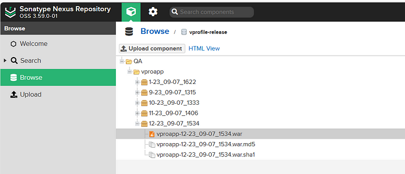

# Project-24: Continuous Delivery Using Jenkins & Ansible

[*Project Source*](https://www.udemy.com/course/devopsprojects/learn/lecture/23900802#overview)


## IMPORTANT
- This project is an extension of the CI project from Project-5. All setup is needed from Project-5 to be able to join in this project. Tokens, credentials, Github webhook and Sonarqube webhook may need updates before running the job.
We need to update `Jenkins URL` in `vprofileciproject` GitHub Webhook.

## Pre-Requisites:
* Jenkins server from CI-Project-5
* Nexus Server from CI-Project-5
* SonarQube server from CI-Project-5
* AWS Account
* Git
* GitHub Account
* Slack

## Step-1: Continuous Integration & Webhook

- First, increase the volume size of jenkins root volume
- PS: ensure all instances are stopped


- Update `Jenkins URL` in `vprofileciproject` GitHub Webhook, then run the `vprofile-ci-pipeline` in Jenkins to test pipeline.


- SSH into jenkins-server to validate the root volume
```sh
sudo -i
fdisk -l
df -h
```


## Step-2: Prepare App-Server Staging

# Launch App Staging Server

- Launch an EC2 instance with the details below.
```sh
Name: app01-staging
AMI: Ubuntu 20.04
InstanceType: t2.micro
Keypair: app-key
SecGrp: 
* Allow SSH on port 22 from MyIP (To be able to connect to server)
* Allow Custom TCP on port 8080 from MyIP (To be able to check app from browser)
* Allow SSH from Jenkins-SG (Ansible will SSH into this server to run the playbook)
```

# Create Route53 DNS record for App-staging

- Create a Private Hosted zone for this project.
```sh
Name: vprofile.project
Private Zone
Region: us-east-1
VPC: default-vpc
```

- Once the Hosted Zone is created, create an `A Record` by using `private_ip_of_app_server`.


# Add private SSH key to Jenkins credentials
- Go to Jenkins Manage `Jenkins` -> `Credentials` -> `global`. Ansible will use this credential to SSH into our App server.
```sh
Type SSH login with private key
ID: applogin
description: applogin
user: ubuntu
Private Key: copy the content from cat Downloads/app-key.pem
```

## Step-3: Ansible in Jenkins
- Install Ansible to our Jenkins server, then add Ansible plugin to Jenkins. Get ansible installation steps from this link >>> Ansible Installation steps for Ubuntu
```sh
ssh -i Downloads/keyname.pem ubuntu@<public_ip_of_server>
sudo -i
sudo apt update
sudo apt install software-properties-common
sudo add-apt-repository --yes --update ppa:ansible/ansible
sudo apt install ansible -y
ansible --version
```

- Go to Jenkins dashboard, then `Manage Jenkins` -> `Manage Plugins` -> Available, search and install Ansible Plugin without restart.
```sh
Ansible
```

## Step-4: Prepare Source Code
- Go to your local repository for vprofileciproject, This is a private repository created in Project-5.
- Create a new branch from `ci-jenkins` branch and call it as `cicd-jenkins-ansible`.
```sh
git checkout ci-jenkins
git checkout -b cicd-jenkins-ansible
```

- Add code from j`enkins-ansible-code` branch of `https://github.com/engrrichie/vprofile-project.git` repository.
- Download zip from this branch. Extract and copy `ansible` directory under our local `vprofileciproject` directory in `cicd-jenkins-ansible` branch.

```sh
git add .
git commit -m "adding ansible code"
git push origin cicd-jenkins-ansible
```

## Step-5: Tomcat Playbook

- Prepare the playbooks to deploy our artifact to Tomcat server. 
- Under `ansible/` directory we have `templates` folder which have files to setup system file for Tomcat on different`OS`.


- We will use the `tomcat_setup.yml` playbook to setup our Tomcat server. 
- After setup is complete, Ansible will run `vpro-app-Site.yml` to deploy our application.


## Step-6: Jenkinsfile & Inventory

- We have uploaded ansible/ directory with files in our `vprofileciproject` repository, add the below stage the Jenkinsfile
```sh
stage('Ansible Deploy to staging'){
            steps {
                ansiblePlaybook([
                inventory   : 'ansible/stage.inventory',
                playbook    : 'ansible/site.yml',
                installation: 'ansible',
                colorized   : true,
       credentialsId: 'applogin',
       disableHostKeyChecking: true,
                extraVars   : [
                    USER: "admin",
                    PASS: "${NEXUSPASS}",
           nexusip: "172.31.3.178",
           reponame: "vprofile-release",
           groupid: "QA",
           time: "${env.BUILD_TIMESTAMP}",
           build: "${env.BUILD_ID}",
                    artifactid: "vproapp",
           vprofile_version: "vproapp-${env.BUILD_ID}-${env.BUILD_TIMESTAMP}.war"
                ]
             ])
```

- In `vprofileciproject` repository, under ansible directory, create `stage. Inventory` file. Instead of IP address, use the DNS record 
created in Route53


- Before updating the `Jenkinsfile`, add another credential to Jenkins for `nexus password`.

```sh
Type: Secret text
Secret: <pass your nexus password>
ID: nexuspass
description nexuspass
```
- Create a pipeline in Jenkins, with name `cicd-jenkins-ansible-stage`.
```sh
Build Trigger: GitSCM polling
Pipeline from: SCM
Git
URL: SSH url of vprofileci project 
Credentials: githublogin
Branch: cicd-jenkins-ansible
```

- Go to AWS console and add a `Inbound rule` to `Nexus server`.
```sh
- Allow on port 8081 from app-SG (since app server will download the artifact from Nexus)
```
- Now we can trigger our pipeline.


- Confirm from browser if the application is working properly using the `app01-staging IPaddress :8080`


## Step-6: Preparing App-Server for Prod

- In this project, we are deploying only for one instance. But we can deploy application to many servers as well just by adding the server names to under appsrvgrp in the inventory file we created as below:
```sh
[appsrvgrp]
app01stg.vprofile.project
```
# Launch App Server for Prod
- Launch an EC2 instance with details below.
```sh
Name: app01-prod
AMI: Ubuntu 20.04
InstanceType: t2.micro
Keypair: appkey-prod
SecGrp: app-sg
```

# Create Route53 DNS record for App-prod
- From the already created hosted zone ,create an `A Record` by using ``private_ip_of_app_prod_server` in `vprofile.Project` Private Hosted Zone


# Add private SSH key to Jenkins credentials
- Go to Jenkins `Manage Jenkins` -> `Credentials` -> `global`. Ansible will use this credential to SSH into App server.
```sh
Type SSH login with private key
ID: applogin-prod
description: applogin-prod
user: ubuntu
Private Key: copy the content from app-key-prod.pem
```

## Step-7: Jenkinsfile for Prod
- Create a new branch on local repository then open it in VS Code
```sh
git checkout cicd-jenkins-ansible
git checkout -b cicd-jenkins-ansible-prod
code .
```

- Rename the inventory as prod.inventory and added DNS record for prod.
```sh
[appsrvgrp]
app01prd.vprofile.project
```
- Create a new Jenkinsfile, remove unwanted stages in the previous file, since there is an already deployed artifact from the staging environment.
- Below is the new Jenkinsfile

```sh
def COLOR_MAP = [
    'SUCCESS' : 'good',
    'FAILURE' : 'danger'
]
pipeline {
    agent any
    environment {
        NEXUSPASS = credentials('nexuspass')
    }
    stages {
         stage('Setup parameters') {
            steps {
                script { 
                    properties([
                        parameters([
                            string(
                                defaultValue: '', 
                                name: 'BUILD', 
                            ),
                     string(
                                defaultValue: '', 
                                name: 'TIME', 
                            )
                        ])
                    ])
                }
            }
         }
        stage('ANSIBLE DEPLOY TO STAGING'){
            steps {
                 ansiblePlaybook([ 
                 inventory: 'ansible/prod.inventory',
                 playbook: 'ansible/site.yml',
                 installation: 'ansible',
                 colorized: true,
                 credentialsId: 'applogin-prod',
                 disableHostKeyChecking: true,
                 extraVars: [
                     USER: "admin",
                     PASS: "${NEXUSPASS}",
                     nexusip: "172.31.3.178",
                     reponame: "vprofile-release",
                     groupid: "QA", 
                     time: "${env.TIME}",
                     build: "${env.BUILD}",
                     artifactid: "vproapp",
                     vprofile_version: "vproapp-${env.BUILD}-${env.TIME}.war"
                 ]
               ]) 
            }
        }
    }
    post{
        always {
            echo 'Slack Notifications'
            slackSend channel: '#jenkinscicd',
                color: COLOR_MAP[currentBuild.currentResult],
                message: "*${currentBuild.currentResult}:* Job ${env.JOB_NAME} build ${env.BUILD_NUMBER} \n More info at: ${env.BUILD_URL}"
        }
    }
}
```
- Create a new pipeline in Jenkins with details below and save it.
```sh
Name: cicd-jenkins-ansible-prod
Kind: Pipeline
Copy from: cicd-jenkins-ansible-stage
### We only need to update branch in this setup ###
Branch: cicd-jenkins-ansible-prod
```
- Refresh the page to see `Build with Parameters` option. You may need to `Build Now` and `Cancel` if you can't find the "build with parameters option".
- Setup the pipeline with user input, we need to specify exactly which Build artifact should be deployed to Prod from Nexus.
- We get the exact artifact from Nexus with `Build #` and `Time`.


- prod pipeline built successfully


- Verify from browser that our application successfully deployed to prod server by using our app-prod server Ip address :8080


## Step-8: Complete CICD flow
- This is to merge the code from staging to production branch
- Configure the prod pipeline not to run automatically by unchecking the`Github hook trigger for GITScm polling` so as to deploy the latest artifact
- Switch to stage branch on VScode `cicd-jenkins-ansible-stage`
- Merge the code changes to production branch using below commands from the staging branch
```sh
git checkout cicd-jenkins-ansible-prod
git merge cicd-jenkins-ansible
```

- Go to jenkins, use the `Build with Parameters` option, and specify exactly which Build artifact should be deployed to Prod from stage.


## Step-9: Clean up
